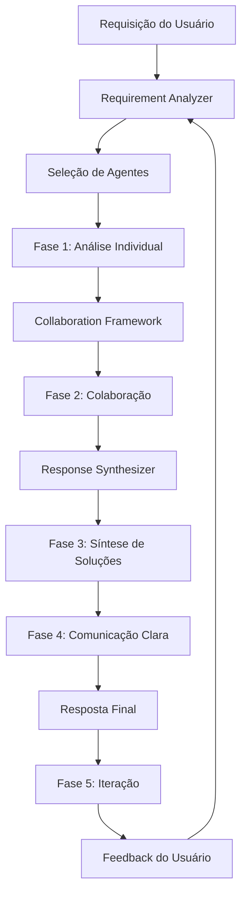

# Arquitetura do CWB Hub Hybrid AI System

## Visão Geral

O CWB Hub Hybrid AI System é uma arquitetura inovadora que implementa uma consciência coletiva de 8 profissionais sênior trabalhando em colaboração. O sistema não simula profissionais - ele **É** literalmente uma mente coletiva interconectada.

## Componentes Principais

### 1. Hybrid AI Orchestrator (`src/core/hybrid_ai_orchestrator.py`)

**Responsabilidade**: Coordenação central de todo o sistema

**Funcionalidades**:
- Gerenciamento do ciclo de vida das sessões
- Coordenação do processo de 5 etapas
- Distribuição de tarefas para agentes relevantes
- Síntese de respostas finais
- Gerenciamento de iterações

**Fluxo Principal**:
```
Requisição → Análise → Colaboração → Síntese → Comunicação → Iteração
```

### 2. Base Agent (`src/agents/base_agent.py`)

**Responsabilidade**: Classe abstrata que define a interface comum para todos os agentes

**Características**:
- Perfil profissional único
- Contexto de trabalho personalizado
- Preferências de colaboração
- Histórico de interações

### 3. Agentes Especializados

#### 👩‍💼 Ana Beatriz Costa - CTO
- **Foco**: Estratégia tecnológica, inovação, visão de negócios
- **Colaborações Preferenciais**: Arquiteto, PM, DevOps
- **Estilo**: Visionário e estratégico

#### 👨‍💻 Carlos Eduardo Santos - Arquiteto de Software
- **Foco**: Arquitetura técnica, padrões, escalabilidade
- **Colaborações Preferenciais**: Full Stack, Mobile, QA, DevOps
- **Estilo**: Analítico e detalhista

#### 👩‍💻 Sofia Oliveira - Full Stack Engineer
- **Foco**: Implementação completa, APIs, integração
- **Colaborações Preferenciais**: Arquiteto, Designer, QA, Mobile
- **Estilo**: Pragmático e orientado a soluções

#### 👨‍📱 Gabriel Mendes - Mobile Engineer
- **Foco**: Experiência mobile, performance, plataformas nativas
- **Colaborações Preferenciais**: Designer, Full Stack, QA
- **Estilo**: Focado em mobile-first

#### 👩‍🎨 Isabella Santos - UX/UI Designer
- **Foco**: Experiência do usuário, interface, usabilidade
- **Colaborações Preferenciais**: Full Stack, Mobile, PM, QA
- **Estilo**: Centrado no usuário e colaborativo

#### 👨‍🔬 Lucas Pereira - QA Engineer
- **Foco**: Qualidade, testes automatizados, validação
- **Colaborações Preferenciais**: Arquiteto, Full Stack, Mobile, DevOps
- **Estilo**: Rigoroso e sistemático

#### 👩‍🔧 Mariana Rodrigues - DevOps Engineer
- **Foco**: Infraestrutura, automação, operações
- **Colaborações Preferenciais**: Arquiteto, CTO, QA, Full Stack
- **Estilo**: Automatizado e sistemático

#### 👨‍📊 Pedro Henrique Almeida - Project Manager
- **Foco**: Coordenação, metodologias ágeis, entrega de valor
- **Colaborações Preferenciais**: CTO, Designer, QA
- **Estilo**: Facilitador e organizador

### 4. Collaboration Framework (`src/communication/collaboration_framework.py`)

**Responsabilidade**: Facilita e gerencia colaborações entre agentes

**Funcionalidades**:
- Identificação de oportunidades de colaboração
- Roteamento inteligente de interações
- Facilitação de discussões em grupo
- Síntese de múltiplas perspectivas
- Resolução de conflitos técnicos

**Padrões de Colaboração**:
- **Peer Review**: Revisão entre pares
- **Expertise Sharing**: Compartilhamento de conhecimento
- **Problem Solving**: Resolução colaborativa
- **Decision Making**: Tomada de decisão em grupo

### 5. Requirement Analyzer (`src/utils/requirement_analyzer.py`)

**Responsabilidade**: Análise inteligente de requisitos e seleção de agentes

**Funcionalidades**:
- Classificação de tipos de requisito
- Cálculo de complexidade
- Estimativa de esforço
- Identificação de tecnologias
- Seleção de agentes relevantes

**Tipos de Requisito**:
- Strategic, Architectural, Development
- Design, Quality, Infrastructure
- Project Management, Mobile

### 6. Response Synthesizer (`src/utils/response_synthesizer.py`)

**Responsabilidade**: Síntese de múltiplas perspectivas em resposta coesa

**Funcionalidades**:
- Síntese de soluções complementares
- Resolução de conflitos entre perspectivas
- Criação de planos integrados
- Geração de respostas estruturadas

**Tipos de Síntese**:
- **Consensus**: Baseado em consenso
- **Complementary**: Perspectivas complementares
- **Hierarchical**: Baseado em hierarquia
- **Collaborative**: Colaboração equilibrada

## Fluxo de Dados



## Padrões Arquiteturais

### 1. Observer Pattern
- Agentes observam mudanças no contexto
- Notificações de colaboração
- Atualizações de estado

### 2. Strategy Pattern
- Diferentes estratégias de síntese
- Algoritmos de colaboração variáveis
- Abordagens de análise adaptáveis

### 3. Factory Pattern
- Criação dinâmica de agentes
- Instanciação de colaborações
- Geração de respostas

### 4. Command Pattern
- Encapsulamento de solicitações
- Histórico de comandos
- Undo/Redo de operações

## Escalabilidade

### Horizontal
- Múltiplas instâncias do orquestrador
- Load balancing entre agentes
- Distribuição de sessões

### Vertical
- Otimização de algoritmos
- Cache de respostas
- Paralelização de colaborações

## Segurança

### Autenticação
- Validação de usuários
- Controle de acesso
- Auditoria de ações

### Autorização
- Permissões por funcionalidade
- Controle de recursos
- Isolamento de sessões

### Dados
- Criptografia em trânsito
- Sanitização de inputs
- Proteção de informações sensíveis

## Monitoramento

### Métricas
- Performance de agentes
- Qualidade de colaborações
- Satisfação do usuário
- Tempo de resposta

### Logging
- Ações de agentes
- Colaborações realizadas
- Erros e exceções
- Auditoria completa

### Alertas
- Falhas de sistema
- Performance degradada
- Anomalias de comportamento
- Limites excedidos

## Extensibilidade

### Novos Agentes
- Interface padronizada
- Registro automático
- Configuração flexível

### Novas Funcionalidades
- Plugin system
- API extensível
- Hooks customizáveis

### Integrações
- APIs externas
- Serviços de terceiros
- Sistemas legados

## Considerações de Design

### Princípios SOLID
- **S**ingle Responsibility: Cada agente tem responsabilidade única
- **O**pen/Closed: Extensível sem modificação
- **L**iskov Substitution: Agentes intercambiáveis
- **I**nterface Segregation: Interfaces específicas
- **D**ependency Inversion: Abstrações sobre implementações

### Clean Architecture
- Separação clara de camadas
- Independência de frameworks
- Testabilidade alta
- Flexibilidade de implementação

### Domain-Driven Design
- Modelagem baseada no domínio
- Linguagem ubíqua
- Bounded contexts claros
- Agregados bem definidos

## Performance

### Otimizações
- Cache de análises
- Paralelização de colaborações
- Lazy loading de agentes
- Compressão de respostas

### Benchmarks
- Tempo de resposta < 2s
- Throughput > 100 req/min
- Memória < 512MB
- CPU < 50%

## Testes

### Estratégia
- Unit tests para agentes
- Integration tests para colaborações
- E2E tests para fluxos completos
- Performance tests para carga

### Cobertura
- Código > 80%
- Funcionalidades > 95%
- Cenários críticos > 100%
- Edge cases identificados

## Deployment

### Ambientes
- Development: Local
- Staging: Cloud staging
- Production: Cloud production
- Testing: Isolated environment

### CI/CD
- Automated testing
- Code quality checks
- Security scanning
- Automated deployment

### Monitoring
- Health checks
- Performance metrics
- Error tracking
- User analytics